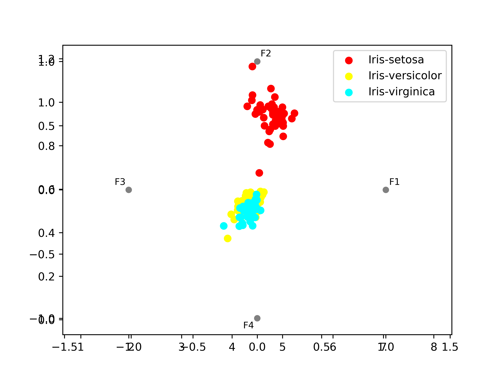

# 数据挖掘 project1 - density peak clustering 算法实现
李阳昊 2018310814    

## 实现过程
详见DPC/DPC.py   
- step 1: 计算 cut distance, 根据原论文, cut distance 应该使得在 cut distance 以内的相邻点对的数量占总数量的1%~2%, 这里使用二分法自动查找 cut distance    
- step 2: 计算 $\rho$, 简单计数
- step 3: 计算 $\delta$, 简单$O(n^2)$比较
- step 4: 确定类中心点, 根据原论文, $\rho\delta$ 这一乘积越大, 对应点越有可能是类中心点, 因此本实现中根据输入确定的类数目, 选取该乘积最大的相应点作为类中心

## 评测
### 数据集1: iris flowers
数据集包含3个类别，每个类别50个实例，其中每个类别指的是一种虹膜植物。一类可以与其他两类线性分离;后者不能彼此线性分离. 详见 https://archive.ics.uci.edu/ml/datasets/iris    

分类效果: 
- f1_macro: 0.9060654857756306    
- f1_micro: 0.9066666666666666

可视化: 

### 数据集2: student knowledge
关于学生关于电气直流电机主题的知识状态的真实数据集, 分为4个类别, 共有5个特征. 详见 http://archive.ics.uci.edu/ml/datasets/User+Knowledge+Modeling?ref=datanews.io  

我们分别用欧氏距离和曼哈顿距离进行测试

#### 欧式距离
分类效果:    
- f1_macro: 0.2883999891232214    
- f1_micro: 0.38132295719844356    

可视化: 

#### 曼哈顿距离
分类效果:    
- f1_macro: 0.3617955439056357    
- f1_micro: 0.603112840466926

可视化: 

 
## 总结
density peak clustering 在简单的数据集上表现较好; 在复杂的数据集上, 需要
- 更好的特征处理和距离计算
- 更好的类中心选取策略

